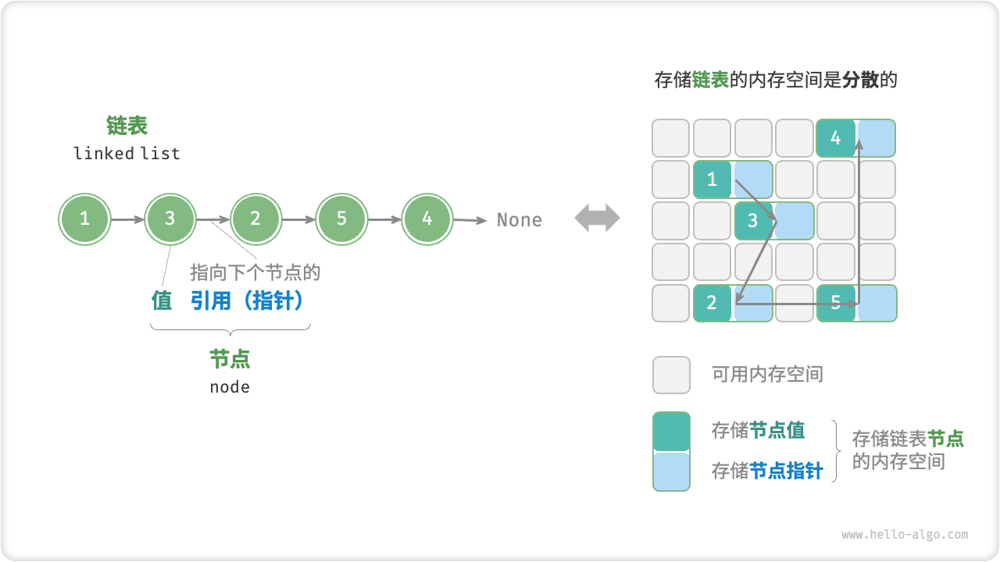
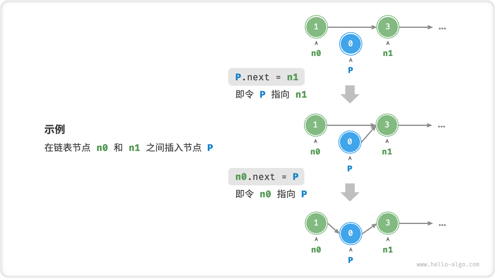
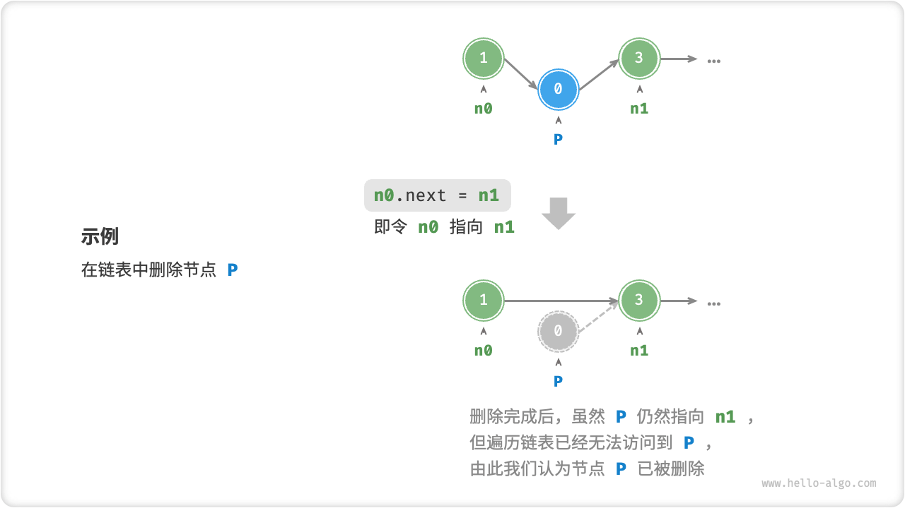

## Chapter 4. Linked List

内存空间是所有程序的公共资源，在一个复杂的系统运行环境下，空闲的内存空间可能散落在内存各处。我们知道，**存储数组的内存空间必须是连续的**，而当数组非常大时，内存可能无法提供如此大的连续空间。此时链表的灵活性优势就体现出来了。
*Memory space is a common resource for all programs, and in a complex system operating environment, free memory space may be scattered all over memory. We know that the memory space for storing an array must be contiguous, and when the array is very large, the memory may not be able to provide such a large contiguous space. This is where the flexibility of chained tables comes into play.*

「链表 linked list」是一种线性数据结构，其中的每个元素都是一个节点对象，各个节点通过“引用”相连接。引用记录了下一个节点的内存地址，通过它可以从当前节点访问到下一个节点。
*A "linked list" is a linear data structure in which each element is a node object and each node is connected by a "reference". The reference records the memory address of the next node, which can be accessed from the current node to the next node.*

链表的设计使得**各个节点可以被分散存储在内存各处**，它们的内存地址是无须连续的。
*Chained tables are designed so that individual nodes can be dispersed throughout memory and their memory addresses are not required to be contiguous.*

链表的组成单位是「节点 node」对象。每个节点都包含两项数据：节点的“值”和指向下一节点的“引用”。
*The unit of a linked table is the "node node" object. Each node contains two pieces of data: the "value" of the node and a "reference" to the next node.*

* 链表的首个节点被称为“头节点*head node*”，最后一个节点被称为“尾节点*tail node*”。
* 尾节点指向的是“空”，它在 Java、C++ 和 Python 中分别被记为 null、nullptr 和 None 。
* 在 C、C++、Go 和 Rust 等支持指针的语言中，上述的“引用”应被替换为“指针”。

如以下代码所示，链表节点 ```ListNode``` 除了包含值，还需额外保存一个引用（指针）。因此**在相同数据量下，链表比数组占用更多的内存空间**。



```c
// c
/* 链表节点结构体 */
typedef struct ListNode {
    int val;               // 节点值
    struct ListNode *next; // 指向下一节点的指针
} ListNode;

/* 构造函数 */
ListNode *newListNode(int val) {
    ListNode *node, *next;
    node = (ListNode *) malloc(sizeof(ListNode));
    node->val = val;
    node->next = NULL;
    return node;
}
```
```cpp
/* 链表节点结构体 */
struct ListNode {
    int val;         // 节点值
    ListNode *next;  // 指向下一节点的指针
    ListNode(int x) : val(x), next(nullptr) {}  // 构造函数
};
```
```py
# python
class ListNode:
    """链表节点类"""
    def __init__(self, val: int):
        self.val: int = val               # 节点值
        self.next: ListNode | None = None # 指向下一节点的引用

```

#### 1. 链表常用操作

##### (1) 初始化链表
建立链表分为两步，第一步是初始化各个节点对象，第二步是构建引用指向关系。初始化完成后，我们就可以从链表的头节点出发，通过引用指向 ```next``` 依次访问所有节点。
```c
// c
/* 初始化链表 1 -> 3 -> 2 -> 5 -> 4 */
// 初始化各个节点
ListNode* n0 = newListNode(1);
ListNode* n1 = newListNode(3);
ListNode* n2 = newListNode(2);
ListNode* n3 = newListNode(5);
ListNode* n4 = newListNode(4);
// 构建引用指向
n0->next = n1;
n1->next = n2;
n2->next = n3;
n3->next = n4;
```
```cpp
/* 初始化链表 1 -> 3 -> 2 -> 5 -> 4 */
// 初始化各个节点
ListNode* n0 = new ListNode(1);
ListNode* n1 = new ListNode(3);
ListNode* n2 = new ListNode(2);
ListNode* n3 = new ListNode(5);
ListNode* n4 = new ListNode(4);
// 构建节点之间的引用
n0->next = n1;
n1->next = n2;
n2->next = n3;
n3->next = n4;
```
```py
# python
# 初始化链表 1 -> 3 -> 2 -> 5 -> 4
# 初始化各个节点
n0 = ListNode(1)
n1 = ListNode(3)
n2 = ListNode(2)
n3 = ListNode(5)
n4 = ListNode(4)
# 构建引用指向
n0.next = n1
n1.next = n2
n2.next = n3
n3.next = n4
```
数组整体是一个变量，比如数组 ```nums``` 包含元素 ```nums[0]``` 和 ```nums[1]``` 等，而链表是由多个独立的节点对象组成的。我们通常将头节点当作链表的代称，比如以上代码中的链表可被记做链表 ```n0``` 。

##### (2) 插入节点
在链表中插入节点非常容易。如图所示，假设我们想在相邻的两个节点 ```n0``` 和 ```n1``` 之间插入一个新节点 ```P``` ，则只需要改变两个节点引用（指针）即可，时间复杂度为 $O(1)$ 。

相比之下，在数组中插入元素的时间复杂度为 $O(n)$ ，在大数据量下的效率较低。



```c
// c
/* 在链表的节点 n0 之后插入节点 P */
void insert(ListNode *n0, ListNode *P) {
    ListNode *n1 = n0->next;
    P->next = n1;
    n0->next = P;
}
```
```cpp
/* 在链表的节点 n0 之后插入节点 P */
void insert(ListNode *n0, ListNode *P) {
    ListNode *n1 = n0->next;
    P->next = n1;
    n0->next = P;
}
```
```py
# python
def insert(n0: ListNode, P: ListNode):
    """在链表的节点 n0 之后插入节点 P"""
    n1 = n0.next
    P.next = n1
    n0.next = P
```

##### (3) 删除节点
如图所示，在链表中删除节点也非常方便，只需改变一个节点的引用（指针）即可。

请注意，尽管在删除操作完成后节点 ```P``` 仍然指向 ```n1``` ，但实际上遍历此链表已经无法访问到 ```P``` ，这意味着 ```P``` 已经不再属于该链表了。



```c
// c
/* 删除链表的节点 n0 之后的首个节点P */
// 注意：stdio.h 占用了 remove 关键词
void removeItem(ListNode *n0) {
    if (!n0->next)
        return;
    // n0 -> P -> n1
    ListNode *P = n0->next;
    ListNode *n1 = P->next;
    n0->next = n1;
    // 释放内存
    free(P);
}
```
```py
# python
def remove(n0: ListNode):
    """删除链表的节点 n0 之后的首个节点"""
    if not n0.next:
        return
    # n0 -> P -> n1
    P = n0.next
    n1 = P.next
    n0.next = n1
```

##### (4) 访问节点
在链表访问节点的效率较低。我们可以在 $O(1)$ 时间下访问数组中的任意元素。链表则不然，程序需要从头节点出发，逐个向后遍历，直至找到目标节点。也就是说，访问链表的第 $i$ 个节点需要循环 $i-1$ 轮，时间复杂度为 $O(n)$ 。
```c
// c
/* 访问链表中索引为 index 的节点 */
ListNode *access(ListNode *head, int index) {
    while (head && head->next && index) {
        head = head->next;
        index--;
    }
    return head;
}
```
```py
# python
def access(head: ListNode, index: int) -> ListNode | None:
    """访问链表中索引为 index 的节点"""
    for _ in range(index):
        if not head:
            return None
        head = head.next
    return head
```

##### (5) 查找节点
遍历链表，查找链表内值为 ```target``` 的节点，输出节点在链表中的索引。此过程也属于线性查找。
```c
// c
/* 在链表中查找值为 target 的首个节点 */
int find(ListNode *head, int target) {
    int index = 0;
    while (head) {
        if (head->val == target)
            return index;
        head = head->next;
        index++;
    }
    return -1;
}
```
```py
# python
def find(head: ListNode, target: int) -> int:
    """在链表中查找值为 target 的首个节点"""
    index = 0
    while head:
        if head.val == target:
            return index
        head = head.next
        index += 1
    return -1
```