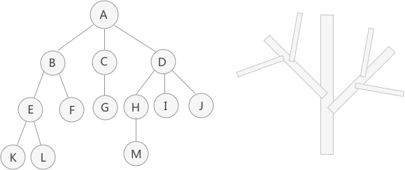
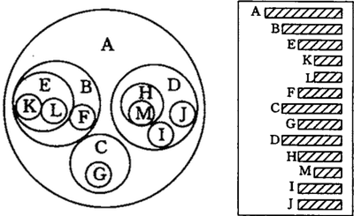

## Chapter 7. Tree
树结构通常用来存储逻辑关系为 "一对多" 的数据。例如：

<center>图1</center>

#### 有关树的术语

##### 1) 结点
和链表类似，树存储结构中也将存储的各个元素称为 "结点"。例如在图 1 中，元素 A 就是一个结点。

对于树中某些特殊位置的结点，还可以进行更细致的划分，比如：
* **父结点（双亲结点）、孩子结点和兄弟结点：** 以图 1 中的结点 A、B、C、D 为例，A 是 B、C、D 结点的父结点（也称为“双亲结点”），而 B、C、D 都是 A 结点的孩子结点（也称“子结点”）。对于 B、C、D 来说，它们都有相同的父结点，所以它们互为兄弟结点；
* **树根结点（简称 "根结点" ）：** 特指树中没有双亲（父亲）的结点，一棵树有且仅有一个根结点。例如图 1 中，结点 A 就是整棵树的根结点；
* **叶子结点（简称 "叶结点" ）：** 特指树中没有孩子的结点，一棵树可以有多个叶子结点。例如图 1 中，结点 K、L、F、G、M、I、J 都是叶子结点。

##### 2) 子树
仍以图 1 的树为例，A 是整棵树的根结点。但如果单看结点 B、E、F、K、L 组成的部分来说，它们也组成了一棵树，结点 B 是这棵树的根结点。通常，我们将一棵树中几个结点构成的“小树”称为这棵树的“子树”。

知道了子树的概念后，树也可以这样定义：树是由根结点和若干棵子树构成的。例如，图 1 这棵树就是由结点 A 和分别以 B、C、D 为根节点的子树构成。
> 注意：单个结点也可以看作是一棵树，该结点即为根结点。例如图 1 中，结点 K、L、F 各自就可以看作是一棵树，只不过树中只有一个根节点而已。

##### 3) 结点的度
一个结点拥有子树的个数，就称为该结点的度（Degree）。例如图 1 中，根结点 A 有 3 个子树，它们的根节点分别是 B、C、D，因此结点 A 的度为 3。
> 比较一棵树中所有结点的度，最大的度即为整棵树的度。比如图 1 中，所有结点中最大的度为 3，所以整棵树的度就是 3。
##### 4) 结点的层次
从一棵树的树根开始，树根所在层为第一层，根的孩子结点所在的层为第二层，依次类推。

对于图 1 这棵树来说，A 结点在第一层，B、C、D 为第二层，E、F、G、H、I、J 在第三层，K、L、M 在第四层。

树中结点层次的最大值，称为这棵树的深度或者高度。例如图 1 这棵树的深度为 4。
> 如果两个结点的父结点不同，但它们父结点的层次相同，那么这两个结点互为堂兄弟。例如图 1 中，结点 G 和 E、F、H、I、J 的父结点都在第二层，所以它们互为堂兄弟。

##### 5) 有序树和无序树
如果一棵树中，各个结点左子树和右子树的位置不能交换，那么这棵树就称为有序树。反之，如果树中结点的左、右子树可以互换，那么这棵树就是一棵无序树。

在有序树中，结点最左边的子树称为 "第一个孩子"，最右边的称为 "最后一个孩子"。拿图 1 这棵树来说，如果它是一棵有序树，那么以结点 B 为根结点的子树为整棵树的第一个孩子，以结点 D 为根结点的子树为整棵树的最后一个孩子。

##### 6) 森林
由 m（m >= 0）个互不相交的树组成的集合就称为森林。比如图 1 中除去 A 结点，那么分别以 B、C、D 为根结点的三棵子树就可以称为森林。

前面讲到，树可以理解为是由根结点和若干子树构成的，而这若干子树本身就是一个森林，因此树还可以理解为是由根结点和森林组成的。

##### 7) 空树（简单了解即可）
空树指的是没有任何结点的树，连根结点都没有。

#### 树的其它表示方法

左图是以嵌套集合的形式表示的（集合之间绝不能相交，即任意两个圆圈不能有交集）。

右图使用的是凹入表示法，最长条为根结点，相同长度的表示在同一层次。例如 B、C、D 长度相同，都为 A 的子结点，E 和 F 长度相同，为 B 的子结点，K 和 L 长度相同，为 E 的子结点，依此类推。

还可以用广义表表示一棵树。例如图 1 用广义表表示为：
```
(A , ( B ( E ( K , L ) , F ) , C ( G ) , D ( H ( M ) , I , J ) ) )
```

