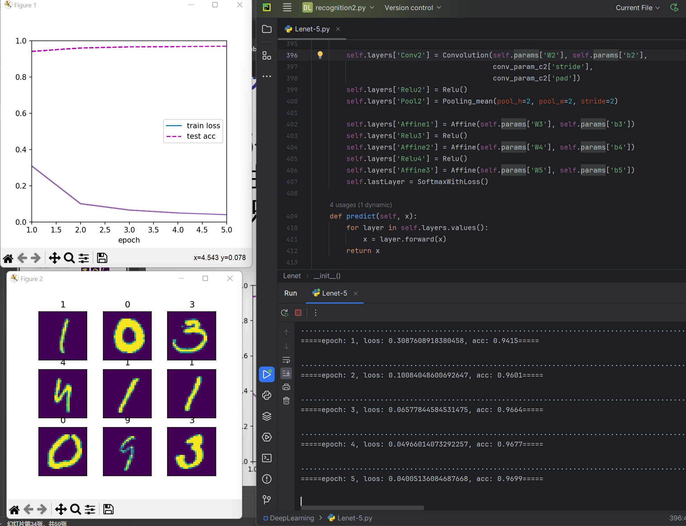

<center>

<br>
<br>

{:height="90%" width="90%"}

<br>
<br>

# **《深度学习方法与实践》实验报告**

<br>
<br>
<br>

**实验标题：** <u> &emsp;&emsp;&emsp;&emsp;实验9&emsp;&emsp;&emsp;&emsp; </u>

**姓&emsp;&emsp;名：** <u> &emsp;&emsp;&emsp;&emsp;杨茜&ensp;&emsp;&emsp;&emsp;&emsp; </u>

**序&emsp;&emsp;号：** <u> &emsp;&emsp;&emsp;&emsp;&emsp;&emsp;&ensp;&emsp;&emsp;&emsp;&emsp; </u>

**专&emsp;&emsp;业：** <u> &emsp;&emsp;&emsp;软件工程&ensp;&emsp;&emsp;&emsp; </u>

**学&emsp;&emsp;号：** <u> &emsp;&ensp;2022210405025&ensp;&emsp; </u>

**指导老师：** <u> &emsp;&emsp;&emsp;&emsp;孙水发&ensp;&emsp;&emsp;&emsp; </u>

<br>
<br>
<br>

**完成日期 &emsp; 2023 年 12 月 1 日**

</center>
<div STYLE="page-break-after: always;"></div>


#### 实验代码

Lenet-5：
```py
import numpy as np
import matplotlib.pyplot as plt
from matplotlib_inline import backend_inline as display
import random
from collections import OrderedDict

from dataset.mnist import load_mnist


class SGD:
    def __init__(self, lr=0.01):
        self.lr = lr

    def update(self, params, grads):
        for key in params.keys():
            params[key] -= self.lr * grads[key]


class Relu:
    def __init__(self):
        self.mask = None

    def forward(self, x):
        self.mask = (x <= 0)
        out = x.copy()
        out[self.mask] = 0
        return out

    def backward(self, dout):
        dout[self.mask] = 0
        dx = dout
        return dx


class Affine:
    def __init__(self, W, b):
        self.W = W
        self.b = b
        self.x = None
        self.original_x_shape = None
        # 权重和偏置参数的导数
        self.dW = None
        self.db = None

    def forward(self, x):
        # 对应张量
        self.original_x_shape = x.shape
        x = x.reshape(x.shape[0], -1)
        self.x = x
        out = np.dot(self.x, self.W) + self.b
        return out

    def backward(self, dout):
        dx = np.dot(dout, self.W.T)
        self.dW = np.dot(self.x.T, dout)
        self.db = np.sum(dout, axis=0)

        dx = dx.reshape(*self.original_x_shape)
        # 还原输入数据的形状（对应张量）
        return dx


def cross_entropy_error(y, t):
    if y.ndim == 1:
        t = t.reshape(1, t.size)
        y = y.reshape(1, y.size)
    # 监督数据是one-hot-vector的情况下，转换为正确解标签的索引
    if t.size == y.size:
        t = t.argmax(axis=1)
    batch_size = y.shape[0]
    return -np.sum(np.log(y[np.arange(batch_size), t] + 1e-7))


def softmax(x):
    if x.ndim == 2:
        x = x.T
        x = x - np.max(x, axis=0)
        y = np.exp(x) / np.sum(np.exp(x), axis=0)
        return y.T
    x = x - np.max(x)  # 溢出对策
    return np.exp(x) / np.sum(np.exp(x))


class SoftmaxWithLoss:
    def __init__(self):
        self.loss = None
        self.y = None
        self.t = None

    def forward(self, X, t):
        self.t = t
        self.y = softmax(X)
        self.loss = cross_entropy_error(self.y, t)
        return self.loss

    def backward(self, dout=1):
        batch_size = self.t.shape[0]
        if self.t.size == self.y.size:
            dx = (self.y - self.t) / batch_size
        else:
            dx = self.y.copy()
            dx[np.arange(batch_size), self.t] -= 1
            dx = dx / batch_size

        return dx


# 分组
def data_iter(features, labels, batch_size):
    num = len(features)
    a = list(range(num))
    for i in range(0, num, batch_size):
        e = min(i + batch_size, num)
        indices = a[i: e]
        yield features[indices], labels[indices]


# 打乱顺序
def a_shuffle(X):
    num = len(X)
    a = list(range(num))
    random.shuffle(a)
    return X[a]


class Accumulator:  # 累加器
    def __init__(self, n):
        self.data = [0.0] * n

    def add(self, *args):
        self.data = [a + float(b) for a, b in zip(self.data, args)]

    def reset(self):
        self.data = [0.0] * len(self.data)

    def __getitem__(self, idx):
        return self.data[idx]


def set_axes(X_label, Y_label, X_lim, Y_lim, X_scale='linear', Y_scale='linear', legend=None, axes=None):
    axes = axes if axes else plt.gca()
    axes.set_xlabel(X_label)
    axes.set_ylabel(Y_label)
    axes.set_xlim(X_lim)
    axes.set_ylim(Y_lim)
    axes.set_xscale(X_scale)
    axes.set_yscale(Y_scale)
    if legend:
        axes.legend(legend)
    axes.grid()


class Animator:
    def __init__(self, xlabel=None, ylabel=None, legend=None, xlim=None,
                 ylim=None, xscale='linear', yscale='linear',
                 fmts=('-', 'm--', 'g-.', 'r:'), nrows=1, ncols=1,
                 figsize=(3.5, 2.5)):
        if legend is None:
            legend = []
        display.set_matplotlib_formats('svg')
        self.fig, self.axes = plt.subplots(nrows, ncols, figsize=figsize)
        if nrows == 1 and ncols == 1:
            self.axes = [self.axes]
        self.config_axes = set_axes(xlabel, ylabel, xlim, ylim, xscale, yscale, legend, axes=self.axes[0])
        self.X, self.Y, self.fmts = None, None, fmts
        self.legend = legend

    def add(self, x, y):  # 传二维以上的array
        if not hasattr(y, '__len__'):
            y = [y]
        n = len(y)
        if not hasattr(x, '__len__'):
            x = [x] * n  # x，y维度要匹配
        if self.X is None:
            self.X = [[] for _ in range(n)]  # 占位
        if self.Y is None:
            self.Y = [[] for _ in range(n)]
        for i, (a, b) in enumerate(zip(x, y)):  # 分组
            if a is not None and b is not None:
                self.X[i].append(a)
                self.Y[i].append(b)
        for x, y, fmt in zip(self.X, self.Y, self.fmts):
            self.axes[0].plot(x, y, fmt)

        self.config_axes
        self.axes[0].legend(self.legend)
        self.axes[0].grid()


def show_images(imgs, num_rows, num_cols, titles=None, scale=1.5):  # @save
    """绘制图像列表"""
    figsize = (num_cols * scale, num_rows * scale)
    _, axes = plt.subplots(num_rows, num_cols, figsize=figsize)
    axes = axes.flatten()
    for i, (ax, img) in enumerate(zip(axes, imgs)):
        ax.imshow(img.reshape((img.shape[-2], img.shape[-1])))
        ax.axes.get_xaxis().set_visible(False)
        ax.axes.get_yaxis().set_visible(False)
        if titles:
            ax.set_title(titles[i])
    return axes


def get_labels(labels):  # 返回标签值
    text_labels = ['0', '1', '2', '3', '4',
                   '5', '6', '7', '8', '9']

    return [text_labels[int(i)] for i in labels]


def train(net, train_iter):
    metric = Accumulator(3)
    i = 0
    for x, y in train_iter:
        if i % 2000 == 0:
            print(end='.')
        y_hat = net.predict(x)
        grad = net.gradient(x, y)
        # SGD
        opti = SGD(lr=lr)
        opti.update(net.params, grad)
        z = net.loss(x, y)
        # print(f'loss: {z/y.shape[0]}')
        metric.add(z, accuracy(y, y_hat), len(y))

    return metric[0] / metric[2], metric[1] / metric[2]


def accuracy(y, y_hat):  # 求精确度
    if len(y_hat.shape) > 1 and y_hat.shape[1] > 1:
        y_hat = y_hat.argmax(axis=1)
    if len(y.shape) > 1 and y.shape[1] > 1:
        y = y.argmax(axis=1)
    cmp = np.sum(y_hat == y)
    return float(cmp)


def im2col(input_data, filter_h, filter_w, stride=1, pad=0):
    N, C, H, W = input_data.shape
    out_h = (H + 2 * pad - filter_h) // stride + 1
    out_w = (W + 2 * pad - filter_w) // stride + 1

    img = np.pad(input_data, [(0, 0), (0, 0), (pad, pad), (pad, pad)], 'constant')
    col = np.zeros((N, C, filter_h, filter_w, out_h, out_w))

    for y in range(filter_h):
        y_max = y + stride * out_h
        for x in range(filter_w):
            x_max = x + stride * out_w
            col[:, :, y, x, :, :] = img[:, :, y:y_max:stride, x:x_max:stride]

    col = col.transpose(0, 4, 5, 1, 2, 3).reshape(N * out_h * out_w, -1)
    return col


def col2im(col, input_shape, filter_h, filter_w, stride=1, pad=0):
    N, C, H, W = input_shape
    out_h = (H + 2 * pad - filter_h) // stride + 1
    out_w = (W + 2 * pad - filter_w) // stride + 1
    col = col.reshape(N, out_h, out_w, C, filter_h, filter_w).transpose(0, 3, 4, 5, 1, 2)

    img = np.zeros((N, C, H + 2 * pad + stride - 1, W + 2 * pad + stride - 1))
    for y in range(filter_h):
        y_max = y + stride * out_h
        for x in range(filter_w):
            x_max = x + stride * out_w
            img[:, :, y:y_max:stride, x:x_max:stride] += col[:, :, y, x, :, :]

    return img[:, :, pad:H + pad, pad:W + pad]


class Convolution:
    def __init__(self, W, b, stride=1, pad=0):
        self.W = W
        self.b = b
        self.stride = stride
        self.pad = pad
        # 中间数据（backward时使用）
        self.x = None
        self.col = None
        self.col_W = None
        # 权重和偏置参数的梯度
        self.dW = None
        self.db = None

    def forward(self, x):
        FN, C, FH, FW = self.W.shape
        N, C, H, W = x.shape
        out_h = int(1 + (H + 2 * self.pad - FH) / self.stride)
        out_w = int(1 + (W + 2 * self.pad - FW) / self.stride)

        col = im2col(x, FH, FW, self.stride, self.pad)
        col_W = self.W.reshape(FN, -1).T  # 滤波器的展开
        out = np.dot(col, col_W) + self.b

        out = out.reshape(N, out_h, out_w, -1).transpose(0, 3, 1, 2)

        self.x = x
        self.col = col
        self.col_W = col_W
        return out

    def backward(self, dout):
        FN, C, FH, FW = self.W.shape
        dout = dout.transpose(0, 2, 3, 1).reshape(-1, FN)

        self.db = np.sum(dout, axis=0)
        self.dW = np.dot(self.col.T, dout)
        self.dW = self.dW.transpose(1, 0).reshape(FN, C, FH, FW)

        dcol = np.dot(dout, self.col_W.T)
        dx = col2im(dcol, self.x.shape, FH, FW, self.stride, self.pad)

        return dx


class Pooling_mean():
    def __init__(self, pool_h, pool_w, stride=1, pad=0):
        self.pool_h = pool_h
        self.pool_w = pool_w
        self.stride = stride
        self.pad = pad

        self.x = None

    def forward(self, x):
        N, C, H, W = x.shape
        out_h = int(1 + (H - self.pool_h) / self.stride)
        out_w = int(1 + (W - self.pool_w) / self.stride)

        col = im2col(x, self.pool_h, self.pool_w, self.stride, self.pad)
        col = col.reshape(-1, self.pool_h * self.pool_w)

        out = np.mean(col, axis=1)
        out = out.reshape(N, out_h, out_w, C).transpose(0, 3, 1, 2)

        self.x = x

        return out

    def backward(self, dout):
        N, C, _, _ = dout.shape
        dout = dout.transpose(0, 2, 3, 1).flatten()

        pool_size = self.pool_h * self.pool_w
        col_W = np.ones((pool_size, 1)) / (pool_size)
        dcol = np.dot(dout.T.reshape(-1, 1), col_W.T)
        dcol = dcol.reshape(N, -1, C * pool_size)
        dx = col2im(dcol, self.x.shape, self.pool_h, self.pool_w, self.stride, self.pad)

        return dx


class Lenet():
    def __init__(self):
        conv_param_c1 = {}
        conv_param_c1['stride'] = 1
        conv_param_c1['pad'] = 2

        conv_param_c2 = {}
        conv_param_c2['stride'] = 1
        conv_param_c2['pad'] = 0

        conv_param_p = {}
        conv_param_p['stride'] = 2
        conv_param_p['pad'] = 0

        self.params = {}
        layersize_He = {'W1': (2 / (1 * 5 * 5)) ** 0.5, 'W2': (2 / (6 * 5 * 5)) ** 0.5, 'W3': (2 / (16 * 5 * 5)) ** 0.5,
                        'W4': (2 / 120) ** 0.5, 'W5': (2 / 84) ** 0.5}

        # 第一层卷积层， 简化版的He初始化
        self.params['W1'] = np.random.normal(0, layersize_He['W1'], (6, 1, 5, 5))
        self.params['b1'] = np.zeros(6)
        # 第三层卷积层
        self.params['W2'] = np.random.normal(0, layersize_He['W2'], (16, 6, 5, 5))
        self.params['b2'] = np.zeros(16)
        # 第五层卷积层（全连接层）
        self.params['W3'] = np.random.normal(0, layersize_He['W3'], (16 * 5 * 5, 120))
        self.params['b3'] = np.zeros(120)
        # 第六层连接层
        self.params['W4'] = np.random.normal(0, layersize_He['W4'], (120, 84))
        self.params['b4'] = np.zeros(84)
        # 输出层
        self.params['W5'] = np.random.normal(0, layersize_He['W5'], (84, 10))
        self.params['b5'] = np.zeros(10)
        # 生成层
        self.layers = OrderedDict()

        self.layers['Conv1'] = Convolution(self.params['W1'], self.params['b1'],
                                           conv_param_c1['stride'],
                                           conv_param_c1['pad'])
        self.layers['Relu1'] = Relu()
        self.layers['Pool1'] = Pooling_mean(pool_h=2, pool_w=2, stride=2)

        self.layers['Conv2'] = Convolution(self.params['W2'], self.params['b2'],
                                           conv_param_c2['stride'],
                                           conv_param_c2['pad'])
        self.layers['Relu2'] = Relu()
        self.layers['Pool2'] = Pooling_mean(pool_h=2, pool_w=2, stride=2)

        self.layers['Affine1'] = Affine(self.params['W3'], self.params['b3'])
        self.layers['Relu3'] = Relu()
        self.layers['Affine2'] = Affine(self.params['W4'], self.params['b4'])
        self.layers['Relu4'] = Relu()
        self.layers['Affine3'] = Affine(self.params['W5'], self.params['b5'])
        self.lastLayer = SoftmaxWithLoss()

    def predict(self, x):
        for layer in self.layers.values():
            x = layer.forward(x)
        return x

    def loss(self, x, t):
        y = self.predict(x)
        return self.lastLayer.forward(y, t)

    def accuracy1(self, x, t, batch_size=100):
        if t.ndim != 1: t = np.argmax(t, axis=1)

        acc = 0.0

        for i in range(int(x.shape[0] / batch_size)):
            tx = x[i * batch_size:(i + 1) * batch_size]
            tt = t[i * batch_size:(i + 1) * batch_size]
            y = self.predict(tx)
            y = np.argmax(y, axis=1)
            acc += np.sum(y == tt)

        return acc / x.shape[0]

    def gradient(self, x, t):
        # 前向
        self.loss(x, t)

        # 后向
        dout = 1
        dout = self.lastLayer.backward(dout)

        layers = list(self.layers.values())
        layers.reverse()
        for layer in layers:
            dout = layer.backward(dout)

        # 设定
        grads = {}
        grads['W1'] = self.layers['Conv1'].dW
        grads['b1'] = self.layers['Conv1'].db
        grads['W2'] = self.layers['Conv2'].dW
        grads['b2'] = self.layers['Conv2'].db

        grads['W3'] = self.layers['Affine1'].dW
        grads['b3'] = self.layers['Affine1'].db
        grads['W4'] = self.layers['Affine2'].dW
        grads['b4'] = self.layers['Affine2'].db
        grads['W5'] = self.layers['Affine3'].dW
        grads['b5'] = self.layers['Affine3'].db

        return grads


(x_train, t_train), (x_test, t_test) = load_mnist(normalize=True, flatten=False, one_hot_label = False)
batch_size = 100
lr = 0.03#学习率
num_epoch = 5
x_show = a_shuffle(x_test)[0:9]
animator = Animator(xlabel='epoch', xlim=[1, num_epoch], ylim=[0.0, 1.0],
                    legend=['train loss', 'test acc'], figsize = (6, 4.5))

net = Lenet()
for epoch in range(num_epoch):
    train_metrics = train(net, data_iter(features = x_train, labels = t_train, batch_size = batch_size))
    train_loss, train_acc = train_metrics
    test_acc = net.accuracy1(x_test, t_test, batch_size=batch_size)
    animator.add(epoch + 1, (train_loss,test_acc,))
    print(f'\n=====epoch: {epoch+1}, loos: {train_loss}, acc: {test_acc}=====\n')

t_show = net.predict(x_show).argmax(axis=1).flatten()
titles = get_labels(t_show)
show_images(x_show, 3, 3, titles =  titles)

plt.show()


```


AlexNet:
```py
import torch
import torch.nn as nn
import torchvision.transforms as transforms
from torch.utils.data import DataLoader
from torchvision.datasets import MNIST


class AlexNet(nn.Module):
    def __init__(self, num_classes=10):
        super(AlexNet, self).__init__()
        self.features = nn.Sequential(
            nn.Conv2d(1, 64, kernel_size=3, stride=1, padding=1),
            nn.ReLU(inplace=True),
            nn.MaxPool2d(kernel_size=2, stride=2),
            nn.Conv2d(64, 192, kernel_size=5, padding=2),
            nn.ReLU(inplace=True),
            nn.MaxPool2d(kernel_size=2, stride=2),
            nn.Conv2d(192, 384, kernel_size=3, padding=1),
            nn.ReLU(inplace=True),
            nn.Conv2d(384, 256, kernel_size=3, padding=1),
            nn.ReLU(inplace=True),
            nn.Conv2d(256, 256, kernel_size=3, padding=1),
            nn.ReLU(inplace=True),
            nn.MaxPool2d(kernel_size=2, stride=2),
        )
        self.avgpool = nn.AdaptiveAvgPool2d((6, 6))
        self.classifier = nn.Sequential(
            nn.Dropout(),
            nn.Linear(256 * 6 * 6, 4096),
            nn.ReLU(inplace=True),
            nn.Dropout(),
            nn.Linear(4096, 4096),
            nn.ReLU(inplace=True),
            nn.Linear(4096, num_classes),
        )

    def forward(self, x):
        x = self.features(x)
        x = self.avgpool(x)
        x = torch.flatten(x, 1)
        x = self.classifier(x)
        return x


transform = transforms.Compose([
    transforms.ToTensor(),
    transforms.Normalize((0.5,), (0.5,))
])
dataset = MNIST(root='.', train=True, transform=transform, download=True)
test_dataset = MNIST(root='.', train=False, transform=transform)

batch_size = 64
train_loader = DataLoader(dataset, batch_size=batch_size, shuffle=True)
test_loader = DataLoader(test_dataset, batch_size=batch_size)

model = AlexNet()
device = torch.device('cuda' if torch.cuda.is_available() else 'cpu')
model = model.to(device)
criterion = nn.CrossEntropyLoss()
optimizer = torch.optim.Adam(model.parameters(), lr=0.001)

num_epochs = 5
for epoch in range(num_epochs):
    model.train()
    for images, labels in train_loader:
        images = images.to(device)
        labels = labels.to(device)
        optimizer.zero_grad()
        outputs = model(images)
        loss = criterion(outputs, labels)
        loss.backward()
        optimizer.step()

        model.eval()
        correct = 0
        total = 0
        with torch.no_grad():
           for images, labels in test_loader:
               images = images.to(device)
               labels = labels.to(device)
               outputs = model(images)
               _, predicted = torch.max(outputs.data, 1)
               total += labels.size(0)
               correct += (predicted == labels).sum().item()

        accuracy = 100 * correct / total
        print(f'Epoch [{epoch+1}/{num_epochs}], Test Accuracy: {accuracy:.2f}%')
```

#### 实验结果

##### Lenet-5



##### AlexNet
